# AIAE Deployment Guide

**Audience:** product owners, project managers, developers, and platform engineers

**Scope:** AIAE DEV and PROD on AWS

**Current example:** Operational Hub
**Last verified:** 28 August 2026

This document explains what happens between a developer pushing code and a user opening the application. It also explains how to add another application without requiring the reader to already understand AWS, Kubernetes, Helm, or Argo CD.

> Short version: GitHub Actions builds the software. AWS stores and runs it. Git repositories describe what should be running. Argo CD continuously makes the real Kubernetes environment match those Git repositories.

## Contents

1. [The system in one minute](#1-the-system-in-one-minute)
2. [Terms used in this document](#2-terms-used-in-this-document)
3. [The four repositories](#3-the-four-repositories)
4. [Who is responsible for what](#4-who-is-responsible-for-what)
5. [The complete architecture](#5-the-complete-architecture)
6. [What happens when a user opens Operational Hub](#6-what-happens-when-a-user-opens-operational-hub)
7. [DEV deployment](#7-dev-deployment)
8. [PROD deployment](#8-prod-deployment)
9. [PROD rollback](#9-prod-rollback)
10. [Database migrations](#10-database-migrations)
11. [Configuration and secrets](#11-configuration-and-secrets)
12. [What Argo CD shows](#12-what-argo-cd-shows)
13. [How to add a new application](#13-how-to-add-a-new-application)
14. [How to add an independent application](#14-how-to-add-an-independent-application)
15. [Daily operations](#15-daily-operations)
16. [Monitoring and logs](#16-monitoring-and-logs)
17. [Troubleshooting](#17-troubleshooting)
18. [Safety rules](#18-safety-rules)
19. [Reference values](#19-reference-values)

## 1. The system in one minute

There are three separate processes. Keeping them separate is the main safety feature of the platform.

| Process | What it does | Why it exists |
|---|---|---|
| **Terraform** | Creates AWS infrastructure such as networks, EKS, RDS, ECR, S3, CloudFront, IAM, and Argo CD. | Infrastructure should be repeatable and reviewable instead of being created manually in the AWS Console. |
| **Continuous Integration and Delivery (GitHub Actions)** | Tests code, builds backend images and frontend files, and records the new versions in Git. | A deployment should use an exact, reproducible build instead of files copied from a developer's laptop. |
| **GitOps reconciliation (Argo CD)** | Reads the desired Kubernetes state from Git and applies it to EKS. | Git becomes the audit trail and source of truth for what runs in the cluster. |

The most important rule is:

> GitHub Actions does not directly deploy Kubernetes objects. It updates Git. Argo CD sees the Git change and performs the Kubernetes deployment.

This is the high-level flow:

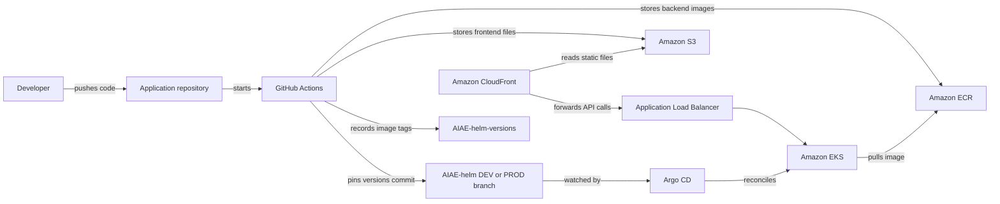

## 2. Terms used in this document

### Application source

The Java, React, tests, Dockerfiles, and GitHub workflows written by the development team. For Operational Hub, this is the `AIAE-operational-hub` repository.

### Build

The process that turns source code into something AWS can run:

- Java becomes a runnable application inside a Docker image.
- Liquibase files become a migration image that can run Maven and update the database.
- React becomes static HTML, JavaScript, and CSS files.

### Docker image

A packaged backend application. It contains the program and its runtime. The same image can be started many times without rebuilding it.

### ECR

Amazon Elastic Container Registry. It stores Docker images. DEV and PROD use different ECR repositories in different AWS accounts.

### EKS

Amazon Elastic Kubernetes Service. It runs backend containers. A Kubernetes cluster can run many related or unrelated applications.

### Pod

One running copy of a backend image. PROD currently keeps at least two Operational Hub pods. If one pod stops, the other one can continue serving requests.

### Deployment

A Kubernetes object that manages pods. It states which image must run, how pods are replaced, and how many copies are required.

### Service

A stable internal address in Kubernetes. Pods can be replaced and receive new IP addresses, while the Service remains stable.

### Ingress and ALB

Ingress contains routing rules. AWS turns those rules into an Application Load Balancer. The ALB receives API traffic and sends it to the correct Kubernetes Service.

### Helm chart

A reusable template for Kubernetes objects. It describes the Deployment, Service, Ingress, health checks, secrets integration, autoscaling, and migration Job.

### GitOps

A deployment model in which Git describes the desired state. A controller, Argo CD in this platform, compares Git with the real cluster and corrects differences.

### Argo CD Application

A set of Git sources plus a destination cluster and namespace. It tells Argo CD what to read and where to apply it.

### Root Application

An Argo CD Application that creates other Argo CD Applications. `aiae-prod-root` is the PROD environment catalog. It is not the business application and it does not process user traffic.

### Child Application

An Argo CD Application for one deployable backend. `operational-hub-api-prod` is the current PROD child application.

### Namespace

A logical area inside Kubernetes. Operational Hub currently uses `aiae-dev` in DEV and `aiae-prod` in PROD.

### S3 and CloudFront

S3 stores the compiled React frontend. CloudFront serves it globally over HTTPS and forwards `/api/*` calls to the backend ALB.

### RDS

Amazon Relational Database Service. It runs PostgreSQL without requiring the team to manage PostgreSQL servers directly.

### Secrets Manager

AWS storage for passwords, API keys, and credentials. Secret values are not stored in Git.

### OIDC role

A short-lived AWS login for GitHub Actions. GitHub proves which repository and environment started the workflow, and AWS returns temporary credentials. There are no permanent AWS access keys in GitHub.

## 3. The four repositories

The deployment uses four repositories because they change for different reasons and have different owners.

| Repository | Contains | Changes when | Why it is separate |
|---|---|---|---|
| [`AIAE-operational-hub`](https://github.com/AiDigital-com/AIAE-operational-hub) | Backend, frontend, tests, Dockerfiles, CI and deployment workflows | Developers change the product | Product code should not be mixed with AWS infrastructure or live environment state. |
| [`AIAE-helm`](https://github.com/AiDigital-com/AIAE-helm) | Reusable Kubernetes chart on `main`; environment catalog on `dev` and `prod` | Kubernetes structure or environment configuration changes | The chart defines *how* an application runs. The environment branches define *where* it runs. |
| [`AIAE-helm-versions`](https://github.com/AiDigital-com/AIAE-helm-versions) | Exact backend and Liquibase image tags | Every successful deployment or rollback | Image versions change frequently and need a small, clear audit trail. |
| [`AIAE-aws-infra`](https://github.com/AiDigital-com/AIAE-aws-infra) | Terraform, cluster add-ons, monitoring, dashboards | AWS infrastructure changes | Infrastructure has a different lifecycle and requires Terraform review and state management. |

### Why two GitOps repositories are used

`AIAE-helm` answers:

> What Kubernetes objects should an Operational Hub backend have?

Examples: Deployment, Service, Ingress, health probes, autoscaling, secrets integration, and a Liquibase Job.

`AIAE-helm-versions` answers:

> Which exact application and Liquibase images should run now?

Example:

```yaml
image:
  tag: "1.0.0-3376572b4ff2"
liquibase:
  image:
    tag: "liquibase-1.0.0-3376572b4ff2"
```

Separating these concerns prevents a normal release from rewriting a large Kubernetes chart.

## 4. Who is responsible for what

### Terraform is responsible for long-lived AWS resources

Terraform creates and updates:

- VPC, public subnets, private subnets, and database subnets
- NAT and networking rules
- EKS cluster and cluster add-ons
- ECR repository
- RDS PostgreSQL
- Secrets Manager secret container
- IAM roles and OIDC trust
- AWS-managed Argo CD capability
- GitHub CodeConnections integration used by Argo CD
- S3 frontend bucket
- CloudFront distribution
- ACM HTTPS certificate request
- CloudWatch logs and alarms
- PROD Prometheus and Grafana infrastructure

Terraform does **not** build the application, choose a release image, or fill sensitive secret values from source code.

### GitHub Actions is responsible for builds and release records

GitHub Actions:

- runs backend and frontend CI checks
- gets temporary AWS credentials through OIDC
- builds backend and Liquibase images
- pushes images to ECR
- builds the React frontend
- uploads frontend files to S3
- invalidates the CloudFront cache
- updates image tags in `AIAE-helm-versions`
- updates the pinned versions commit in the `dev` or `prod` branch of `AIAE-helm`

### Argo CD is responsible for Kubernetes state

Argo CD:

- watches the environment branch in `AIAE-helm`
- reads the chart from `AIAE-helm/main`
- reads image tags from a pinned `AIAE-helm-versions` commit
- renders Kubernetes objects
- runs the database migration before the application rollout
- creates or updates Kubernetes objects
- removes objects deleted from Git because `prune` is enabled
- restores manual cluster changes because `selfHeal` is enabled

### Kubernetes is responsible for running the backend

Kubernetes:

- starts containers
- replaces failed pods
- checks startup, readiness, and liveness endpoints
- performs rolling updates
- keeps the configured number of replicas
- connects Services, Ingress, secrets, and pods

## 5. The complete architecture

DEV and PROD are deliberately separate AWS accounts.

| Environment | AWS account | Cluster | Namespace | Minimum backend replicas |
|---|---:|---|---|---:|
| DEV | `496336474487` | `aiae-operational-hub-dev` | `aiae-dev` | 1 |
| PROD | `125093118532` | `aiae-operational-hub-prod` | `aiae-prod` | 2 |

Both use `us-east-1`.

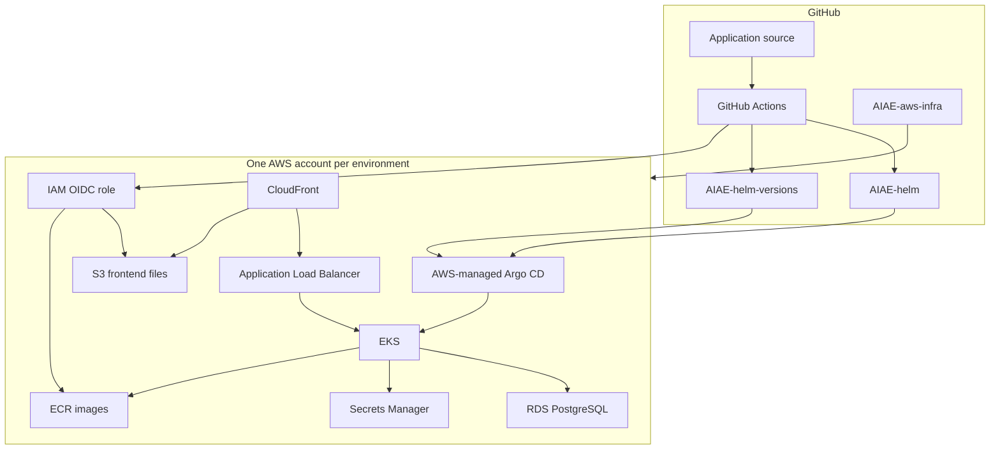

### Why DEV and PROD have separate Argo CD instances

Each Argo CD instance belongs to its AWS account and EKS cluster. A DEV controller cannot accidentally deploy into PROD. Access, networking, IAM, and failures remain isolated.

### Why the frontend is not visible as an Argo CD application

Argo CD manages Kubernetes resources. The React frontend is a set of static files in S3, served by CloudFront. It has no pod, Deployment, or Service, so it does not appear in the Argo CD resource tree.

This is intentional and cheaper than running a web server pod only to serve static files.

## 6. What happens when a user opens Operational Hub

Production URL:

[`https://aiae-operational-hub.aidigital.tech`](https://aiae-operational-hub.aidigital.tech)

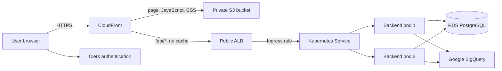

Step by step:

1. DNS sends the user to CloudFront.
2. CloudFront returns the React application from a private S3 bucket.
3. The React application authenticates the user through Clerk.
4. The browser sends backend requests to the same public hostname under `/api/*`.
5. CloudFront does not cache API calls. It forwards them to the AWS ALB.
6. The ALB follows Kubernetes Ingress rules and sends the request to the Operational Hub Service.
7. The Service selects one healthy backend pod.
8. The backend validates the Clerk token and processes the request.
9. The backend reads or writes PostgreSQL and may query BigQuery.
10. The response returns through the Service, ALB, and CloudFront to the browser.

Argo CD and GitHub Actions are not in this request path. Users can continue using a healthy deployment even if GitHub is temporarily unavailable.

## 7. DEV deployment

### When it starts

The workflow file is:

`AIAE-operational-hub/.github/workflows/gitops-dev-deploy-on-push.yml`

The workflow is triggered by a push to any branch whose name looks like `X.Y.Z`, but the deployment job runs only when that branch exactly matches the GitHub DEV environment variable `DEV_DEPLOY_BRANCH`.

Example:

- `DEV_DEPLOY_BRANCH=1.0.0`
- push to `1.0.0`: deploys DEV
- push to `1.0.1`: workflow is visible but the deploy job is skipped

This allows multiple numbered branches to exist while keeping only one active DEV deployment branch.

### Image names

For source commit `abcdef123456...` on branch `1.0.0`:

```text
Application: 1.0.0-snapshot-abcdef123456
Liquibase:   liquibase-1.0.0-snapshot-abcdef123456
```

The commit SHA makes the tag unique. A tag identifies exact source code and is not overwritten.

### The complete DEV sequence

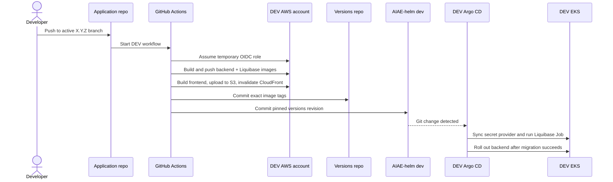

Detailed steps:

1. **GitHub validates required settings.** This fails early if AWS role, region, S3 bucket, CloudFront distribution, or secret name is missing.
2. **GitHub calculates immutable image tags.** The branch and first 12 characters of the commit SHA become the tag.
3. **GitHub assumes the DEV AWS role using OIDC.** No long-lived AWS key is used.
4. **GitHub reads `CLERK_PUBLISHABLE_KEY` from Secrets Manager.** React needs this public identifier at build time. It still comes from the environment secret so configuration remains centralized.
5. **GitHub checks ECR.** If the exact tag already exists after a partially successful retry, it is reused rather than overwritten.
6. **GitHub builds and pushes two images.** One runs the Spring Boot API; the other runs Maven Liquibase.
7. **GitHub builds React.** It uses `npm ci` and `npm run build`.
8. **GitHub uploads React files to S3.** Hashed assets receive long cache headers; `index.html` is not cached.
9. **GitHub invalidates CloudFront.** Users receive the new frontend without waiting for the old cache to expire.
10. **GitHub updates `AIAE-helm-versions/main`.** This records the backend tag, Liquibase tag, and a unique deployment revision.
11. **GitHub updates `AIAE-helm/dev`.** It pins the exact commit just created in the versions repository.
12. **Argo CD detects the `dev` branch change.** Auto-sync is enabled.
13. **Argo CD synchronizes secrets and runs Liquibase.** The application rollout waits for migration success.
14. **Argo CD performs a rolling backend update.** DEV uses one replica, so a short interruption is possible during replacement.
15. **Argo CD reports `Healthy` and `Synced`.** These are the final Kubernetes deployment checks.

### Where tests run

Tests run in the separate `CI` workflow:

- backend: Maven verification and coverage gate
- frontend: generated API check, TypeScript check, tests, and build

The deployment Docker build skips tests to avoid running the same suite again. Branch protection should require the CI workflow before code is accepted into the active numbered branch.

## 8. PROD deployment

### When it starts

PROD never starts from a normal push. A person starts it from GitHub Actions:

1. Open **Actions**.
2. Open **PROD GitOps Deploy Manual**.
3. Select the numbered release branch.
4. Click **Run workflow**.
5. Enter `release_version`, for example `1.0.0`.

The selected branch and `release_version` must match. A `1.0.0` release must run from the `1.0.0` branch. This prevents accidentally labeling code from another branch as `1.0.0`.

### Image names

For source commit `3376572b4ff2...` and release `1.0.0`:

```text
Application: 1.0.0-3376572b4ff2
Liquibase:   liquibase-1.0.0-3376572b4ff2
```

The production tag contains both the human release version and the exact commit.

### The complete PROD sequence

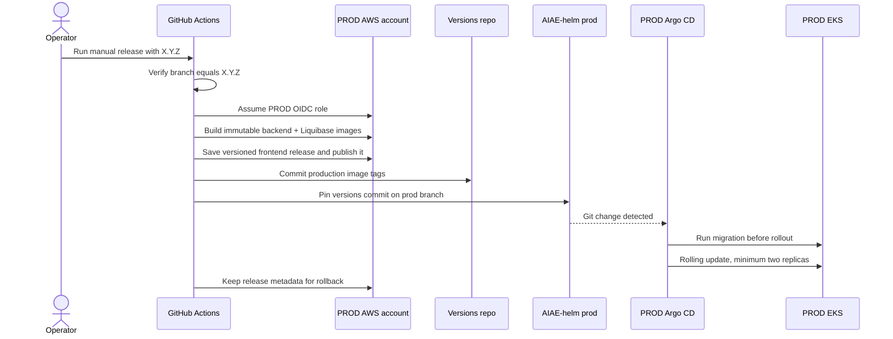

The build and GitOps steps are similar to DEV, with these PROD differences:

- The workflow is manual.
- It uses the PROD GitHub environment and PROD AWS account.
- It requires the selected source branch to match `release_version`.
- It saves a full frontend copy under `s3://<bucket>/releases/<image-tag>/`.
- It writes `release.json` so rollback can verify that backend, migration, and frontend artifacts form one complete release.
- It keeps the current and previous image pair for the same release version.
- Images from other release versions are not removed by that cleanup step.
- PROD runs at least two backend replicas and can autoscale up to ten.
- The rollout uses `maxUnavailable: 0`, so Kubernetes creates a replacement before removing an old healthy pod.

### Why GitOps commits happen after artifacts are stored

Argo CD should never receive an image tag that ECR does not have. The workflow therefore stores backend images and frontend files first, then updates Git. Git becomes the final instruction to deploy already existing artifacts.

## 9. PROD rollback

The rollback workflow is:

`AIAE-operational-hub/.github/workflows/gitops-prod-rollback-manual.yml`

To roll back:

1. Open **Actions**.
2. Open **PROD GitOps Rollback Manual**.
3. Click **Run workflow**.
4. Enter a release version such as `1.0.0`.

The workflow does not rebuild code. It finds the newest complete stored release for that version.

A release is considered complete only if all of these exist:

- application image in ECR
- matching Liquibase image in ECR
- versioned frontend `index.html` in S3
- versioned `release.json` in S3

Then it:

1. updates `AIAE-helm-versions` to the stored tags
2. updates the `AIAE-helm/prod` pin
3. restores the stored frontend files to the live S3 root
4. invalidates CloudFront
5. lets Argo CD reconcile the backend

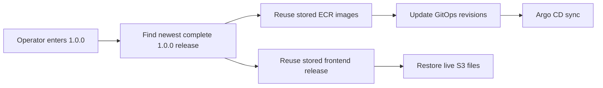

> Important: application rollback does not reverse database migrations. Liquibase `update` is forward-only here. A database change must remain backward-compatible with the previous application version, or it needs a separate, explicitly reviewed database recovery plan.

## 10. Database migrations

Spring Boot has automatic Liquibase startup disabled. This prevents every application pod from trying to change the database during startup.

Instead, Argo CD runs a dedicated Kubernetes Job before the Deployment.

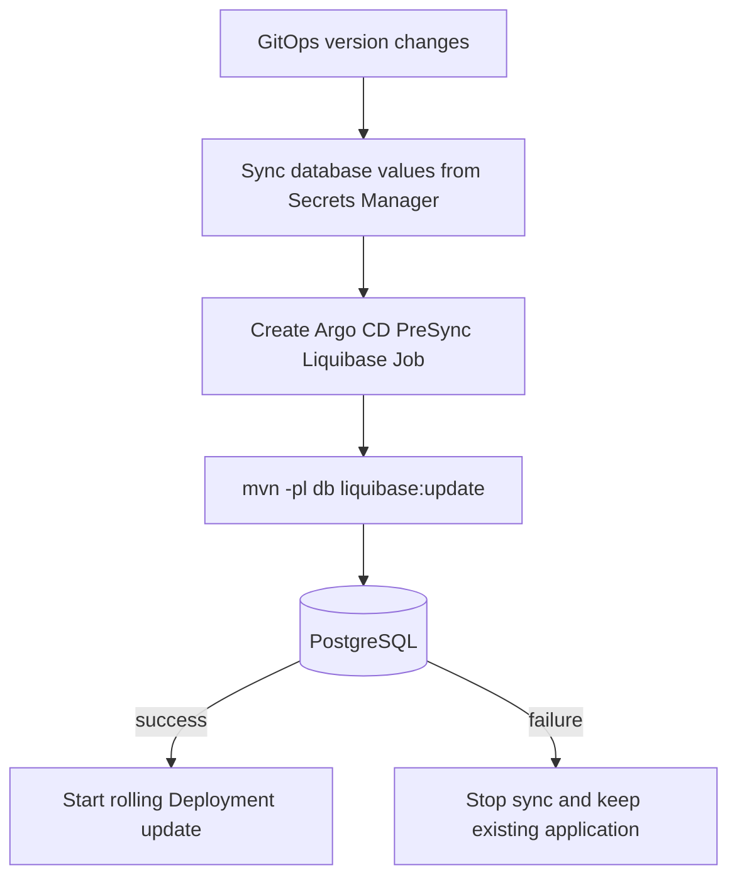

The migration image contains Maven and the backend `db` module. The Job passes the database URL, username, and password to Maven from mounted secret files.

The simplified command is:

```bash
mvn -f backend/pom.xml -pl db liquibase:update \
  -Dliquibase.url="jdbc:postgresql://<host>:<port>/<database>" \
  -Dliquibase.username="<user>" \
  -Dliquibase.password="<password>"
```

### Why migration runs before Deployment

New application code may expect new tables or columns. Running migration first prevents new pods from starting against an old schema.

### Why the old application remains available if migration fails

The Job is an Argo CD `PreSync` hook. A failed hook stops the later Deployment sync. Existing healthy pods are not replaced by code that may require an unavailable schema.

## 11. Configuration and secrets

Configuration is split into two types.

### Non-sensitive configuration

Examples:

- allowed email domain
- authorized browser URL
- BigQuery project, dataset, and location
- application profile
- health probe flag

These values live in `AIAE-helm` environment branches and become a Kubernetes ConfigMap.

### Sensitive configuration

Examples:

- PostgreSQL username and password
- Clerk secret key
- Google service account JSON

These values live in AWS Secrets Manager:

- DEV: `AIAE-DEV/operational-hub`
- PROD: `AIAE-PRD/operational-hub`

The expected keys are:

```text
POSTGRES_HOST
POSTGRES_PORT
POSTGRES_DB
POSTGRES_USER
POSTGRES_PASSWORD
CLERK_PUBLISHABLE_KEY
CLERK_SECRET_KEY
GOOGLE_SERVICE_ACCOUNT_JSON
```

`CLERK_PUBLISHABLE_KEY` is not secret in the browser security sense, but it is stored with environment configuration so DEV and PROD do not need separate hard-coded values in source code.

### Secret delivery flow

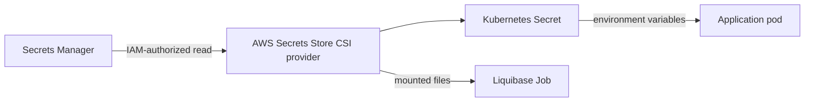

The application pod has an IAM role attached to its Kubernetes ServiceAccount. That role can read only the application secret for its environment.

Secret values must never be committed to any of the four repositories.

## 12. What Argo CD shows

PROD Argo CD:

[`Open PROD Argo CD`](https://86dc5dfee485877c451c369f05eb9bbd82d0214e8deb01de0.eks-capabilities.us-east-1.amazonaws.com)

### 12.1 Applications page

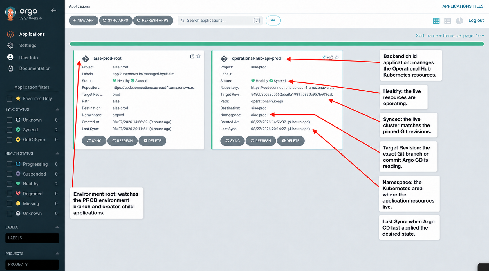

What the two cards mean:

1. **`aiae-prod-root`** is the environment root. It reads `AIAE-helm/prod` and creates child Argo CD Applications.
2. **`operational-hub-api-prod`** is the backend child. It renders and manages the Operational Hub Kubernetes resources.
3. **Healthy** means the running resources pass Kubernetes health checks.
4. **Synced** means the cluster matches the exact Git revisions shown on the card.
5. A green root does not replace checking the child. The root can be healthy while a child application is still progressing.

### 12.2 Root and child relationship

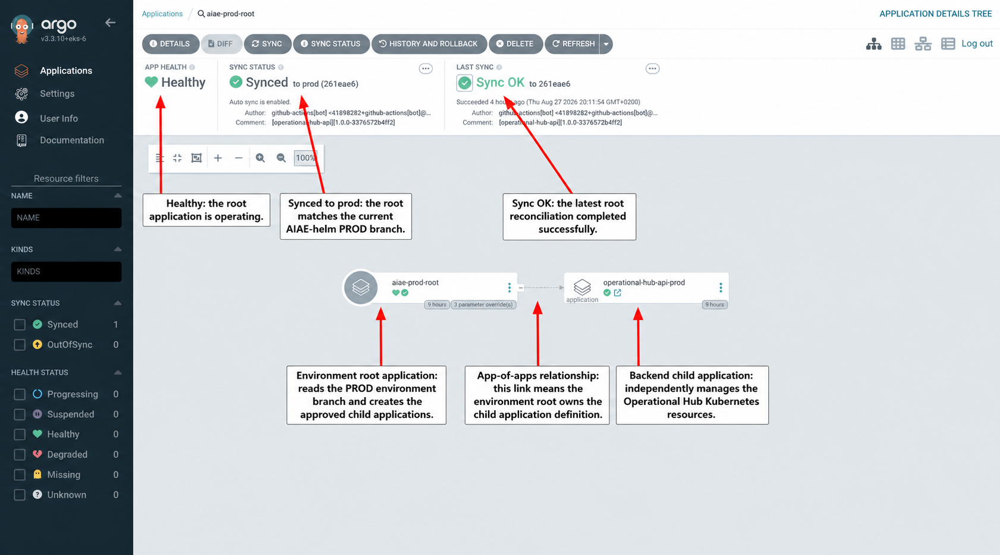

This is the **app-of-apps** pattern:

1. The environment root reads the approved PROD environment catalog.
2. The root creates the child Application definition.
3. The child independently manages one deployable backend and all of its Kubernetes resources.
4. Adding another child does not turn the services into one program. It only lists both deployments in the same environment catalog.

### 12.3 Application summary

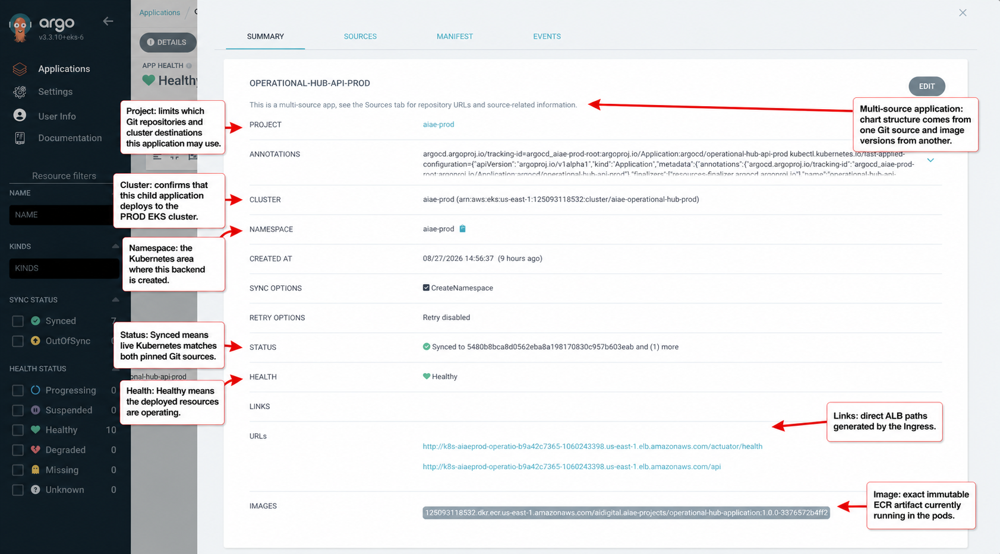

The important fields are:

1. **Project `aiae-prod`** limits which repositories and cluster destinations this application may use.
2. **Cluster** is the PROD EKS cluster. This confirms the application is not pointing to DEV.
3. **Namespace `aiae-prod`** is the Kubernetes area where resources are created.
4. **Status `Synced`** means desired Git state equals live state.
5. **Health `Healthy`** means the live resources are operating successfully.
6. **Auto-sync** means a valid GitOps change is applied without pressing the Argo CD Sync button.
7. **Prune** removes resources that were removed from Git.
8. **Self Heal** restores the Git value if someone manually edits the live cluster.

### 12.4 Backend resources

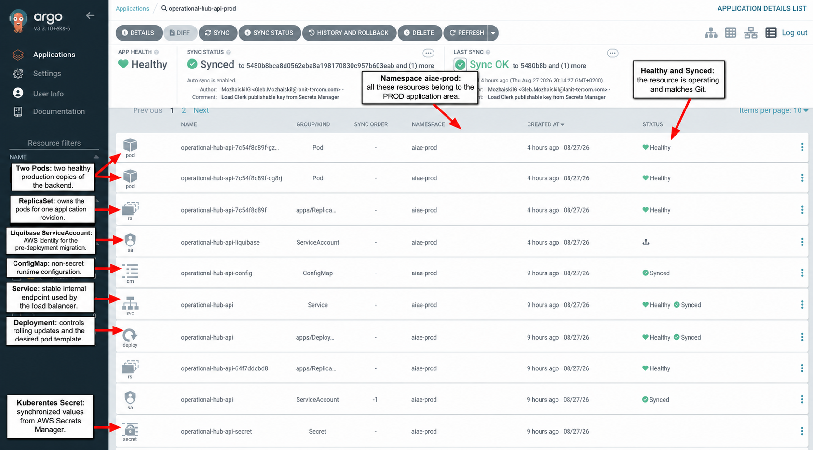

The visible resources mean:

1. **Two Pods** are the two running PROD backend copies.
2. **ReplicaSet** owns the pods for one application revision.
3. **Deployment** manages rolling updates and ReplicaSets.
4. **Service** gives the pods one stable internal address.
5. **ConfigMap** contains non-sensitive environment configuration.
6. **Liquibase ServiceAccount** is used by the pre-deployment migration Job.
7. Page 2 contains resources such as Ingress, HPA, PDB, SecretProviderClass, and older ReplicaSets.

At the top of the screen:

- **APP HEALTH** answers: "Are the live resources working?"
- **SYNC STATUS** answers: "Does live Kubernetes match Git?"
- **LAST SYNC** answers: "Did the most recent reconciliation finish successfully?"

### 12.5 Resource relationship view

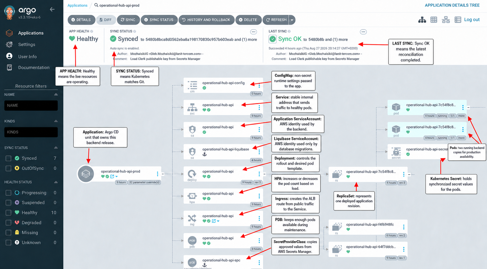

The tree view shows ownership. The Deployment creates a ReplicaSet, and the ReplicaSet creates pods. Other objects such as Service, Ingress, ConfigMap, and secrets support those pods.

### Normal states

| State | Meaning | Action |
|---|---|---|
| Healthy + Synced | Deployment is complete and matches Git. | No action. |
| Progressing + Synced | Git was applied, but pods are still starting. | Wait and check pod events if it lasts longer than the startup limit. |
| Healthy + OutOfSync | The live cluster differs from Git or a new Git change is waiting. | Refresh and inspect the Diff. Auto-sync should normally correct it. |
| Degraded | One or more resources failed health checks. | Open the failed resource and inspect events and logs. |
| Missing | Git expects a resource that does not exist. | Check sync errors, permissions, and hooks. |

## 13. How to add a new application

This section describes the default process for adding a backend service to the same AIAE DEV and PROD clusters.

### First choose what is being added

| New component | Default deployment model |
|---|---|
| Backend that is part of Operational Hub | New ECR repository, Helm chart, versions file, and child Argo CD Application in the same AIAE environment root. |
| Additional route handled by the existing backend | No new application. Add code and API routes to the existing Operational Hub deployment. |
| Static React frontend integrated into the existing SPA | Build it as part of the existing frontend or publish its assets into the existing frontend architecture. It is not an Argo CD pod. |
| Independent application using the same EKS cluster | Own child Argo CD Application, ECR, secrets, routing, and preferably its own namespace. It may still be listed under the environment root. |
| Service requiring strong team or security isolation | Own namespace and Argo CD project. Use a separate root only if ownership or release governance also needs to be independent. |

### One hostname can route to several backends

Several backend applications do not require several public hostnames. A simple path prefix can select the correct Kubernetes Service:

```text
https://application.example.com/api/service-a/*
https://application.example.com/api/service-b/*
https://application.example.com/api/service-c/*
```

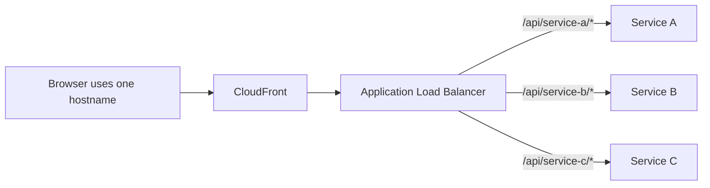

Why this helps: the frontend uses one origin, while each backend remains independently deployable. An API Gateway is not required for ordinary path routing. Add one only when gateway-specific capabilities such as API keys, usage plans, public partner APIs, request transformation, or central throttling are actually required.

### Step 1: define the service contract

Before writing Terraform or Helm, record:

- service name, for example `new-service-api`
- source repository
- owner/team
- container port
- public API path, for example `/api/new-service/*`
- health endpoints
- whether it needs PostgreSQL
- whether it needs its own database or schema
- whether it needs Liquibase
- required secret keys
- minimum and maximum replicas in DEV and PROD
- CPU and memory requests and limits
- whether it needs a separate frontend

Why: these facts determine every later resource name, permission, route, and health check.

### Step 2: prepare the application repository

The service repository needs:

1. A Dockerfile that creates a production image.
2. A CI workflow that runs tests.
3. A DEV deployment workflow.
4. A manual PROD deployment workflow.
5. A manual PROD rollback workflow if the service has independent releases.
6. A health endpoint for startup, readiness, and liveness checks.
7. `/actuator/prometheus` when PROD metrics are required.
8. Environment-based configuration. No AWS password or key may be hard-coded.
9. A Liquibase module and migration Dockerfile if the service owns database changes.

Why: the platform can only deploy an application that can be built, checked, configured, and observed without manual changes inside a pod.

### Step 3: add Terraform resources

Add or reuse Terraform definitions for:

- ECR repository
- GitHub OIDC role permissions for that ECR repository
- Secrets Manager secret
- workload IAM role and Kubernetes ServiceAccount trust
- RDS/database only if a new database is genuinely required
- CloudWatch log routing if PROD application logs are required
- monitoring scrape configuration
- S3 and CloudFront only for a separate frontend

Run:

```bash
terraform fmt -check -recursive
terraform validate
terraform test
terraform plan -var-file=env/dev.tfvars
```

Review the plan before apply. Repeat with the PROD backend configuration and `env/prod.tfvars` only after DEV is proven.

Why: Terraform must create AWS resources and IAM permissions before a workflow or pod tries to use them.

### Step 4: add the Helm chart

In `AIAE-helm/main`, add a chart directory such as:

```text
new-service-api/
  Chart.yaml
  values.yaml
  templates/
    deployment.yaml
    service.yaml
    ingress.yaml
    configmap.yaml
    serviceaccount.yaml
    secret-provider-class.yaml
    db-migration-job-postgres.yaml   # only when needed
```

The chart must define:

- image repository and tag inputs
- namespace
- Service and port
- health probes
- resources
- rolling update policy
- autoscaling values
- ConfigMap values
- Secrets Manager integration
- Ingress path
- PreSync Liquibase Job when needed

Why: the chart is the reusable Kubernetes definition shared by DEV and PROD.

### Step 5: add a versions file

In `AIAE-helm-versions/main`, add:

```text
new-service-api/values.yaml
```

Example:

```yaml
image:
  tag: "not-deployed"
  pullPolicy: IfNotPresent
liquibase:
  image:
    tag: "not-deployed"
    pullPolicy: IfNotPresent
deploymentRevision: "bootstrap"
```

If there is no Liquibase image, remove that block and make the chart disable migrations.

Why: releases update a small file instead of editing the chart.

### Step 6: add the child Application to DEV and PROD

In both `AIAE-helm/dev` and `AIAE-helm/prod`:

1. Add service settings under `services` in `aiae/values.yaml`.
2. Add `aiae/templates/applications/<service>.yaml`.
3. Point the chart source to the exact chart commit in `AIAE-helm/main`.
4. Point the values source to the exact `AIAE-helm-versions` commit.
5. Set the ECR repository for that AWS account.
6. Set the workload IAM role.
7. Set the environment Secrets Manager name.
8. Set replicas and autoscaling independently for DEV and PROD.
9. Set the public route.

Why: the root application can only create a service that is listed in its environment catalog.

### Step 7: configure GitHub environments

Create `dev` and `prod` GitHub environments in the new application repository.

Common variables:

```text
AWS_REGION
AWS_ROLE_TO_ASSUME
APP_CONFIG_SECRET_NAME
GITOPS_HELM_REPOSITORY
GITOPS_VERSIONS_REPOSITORY
```

For a frontend deployment, also add:

```text
FRONTEND_BUCKET
FRONTEND_DISTRIBUTION_ID
```

DEV also needs:

```text
DEV_DEPLOY_BRANCH
```

GitHub secret:

```text
GITOPS_TOKEN
```

The GitOps token needs read/write Contents permission for `AIAE-helm` and `AIAE-helm-versions`. It is used only for Git commits. AWS access comes from OIDC.

Why: DEV and PROD values belong to environments, not source code.

### Step 8: update the deployment workflows

Copy the established workflow structure, then change:

- service/image name
- chart values file path
- environment service pin name
- frontend steps, removing them for a backend-only service
- release metadata location if the service owns a frontend

Keep these behaviors:

- DEV deploys only from `DEV_DEPLOY_BRANCH` and only from an `X.Y.Z` branch.
- DEV tags include `snapshot` and commit SHA.
- PROD is manual and validates branch against `release_version`.
- PROD tags include release version and commit SHA.
- rollback reuses stored artifacts and does not rebuild.
- AWS credentials use OIDC.
- image tags are not overwritten.
- GitOps is updated only after artifacts exist.

### Step 9: protect against concurrent GitOps writes

Several application workflows may update the same `AIAE-helm-versions/main` or environment branch at nearly the same time.

Each workflow must handle a remote change by using one of these patterns:

- central reusable workflow with one deployment queue, or
- pull/rebase and retry before push, or
- pull requests merged by an automated queue

Why: two successful builds must not overwrite each other's GitOps commits or fail only because both started from the same previous commit.

The current Operational Hub concurrency setting prevents overlapping Operational Hub PROD release and rollback runs. It does not by itself serialize workflows from a different source repository.

### Step 10: deploy and verify DEV

Verification checklist:

- CI is green.
- Both image tags exist in DEV ECR.
- The versions repository contains the new tags.
- `AIAE-helm/dev` pins the new versions commit.
- The root application is Healthy and Synced.
- The child application appears in Argo CD.
- Liquibase Job succeeds if enabled.
- Required number of pods is Running and Ready.
- ALB route answers the health endpoint.
- API request succeeds through CloudFront.
- Secrets are present without appearing in logs or Git.
- Metrics appear in PROD only after PROD release.

### Step 11: prepare and deploy PROD

Before the first PROD release:

- create PROD ECR and IAM permissions
- populate the PROD Secrets Manager secret
- confirm RDS connectivity from EKS
- confirm certificate and DNS
- configure the `prod` GitHub environment
- set at least two replicas for a user-facing service where availability is required
- confirm backup and deletion protection settings
- run the manual PROD workflow from the matching numbered branch
- verify Argo CD, application health, API, frontend, logs, and metrics

## 14. How to add an independent application

An application such as Onboarding Platform may use the same EKS cluster without becoming part of Operational Hub.

The environment root name `aiae-dev-root` or `aiae-prod-root` does not mean all child applications are business-related. It is an environment catalog.

Recommended default:

- add a separate child Argo CD Application under the AIAE root
- use a separate namespace, for example `onboarding-dev` and `onboarding-prod`
- use separate ECR, secrets, IAM, database decision, routes, and workflows
- use a separate Argo CD project if repository or team permissions must be isolated

Create a separate root application only when the application needs independent platform ownership, GitOps repository governance, or a separate environment catalog.

## 15. Daily operations

### Deploy the latest DEV commit

Push a commit to the branch currently stored in `DEV_DEPLOY_BRANCH`. The branch name must be `X.Y.Z`.

### Restart DEV without changing code

The current image tag is immutable. Re-running the same workflow for the same commit reuses the image and may update the deployment revision, but a normal no-change push is not available.

Preferred options:

- restart the Deployment from Argo CD only for operational recovery, or
- create a new commit when the purpose is to deploy changed code

A restart does not rebuild the frontend. A frontend rebuild requires the DEV deployment workflow.

### Release PROD

Run **PROD GitOps Deploy Manual** from the matching `X.Y.Z` branch and enter the same `X.Y.Z` value.

### Roll back PROD

Run **PROD GitOps Rollback Manual** and enter the release version to restore. Verify database compatibility first.

### Check a deployment

1. GitHub Actions workflow is green.
2. Argo root is Healthy and Synced.
3. Argo child is Healthy and Synced.
4. Last Sync says `Sync OK`.
5. Expected pods are Healthy.
6. Public health and a real API call work.
7. Frontend loads after CloudFront invalidation.

### Change a secret

1. Update the correct Secrets Manager entry.
2. Do not put the value in Git, Slack, workflow logs, or Terraform variables.
3. Restart or redeploy the application so pods receive the changed value.
4. Confirm authentication and database access.

## 16. Monitoring and logs

Monitoring is enabled for PROD only.

PROD Grafana:

[`Open PROD Grafana`](https://g-8ace4aa6f3.grafana-workspace.us-east-1.amazonaws.com)

The stack contains:

- Prometheus collector in EKS
- Amazon Managed Service for Prometheus with 30-day retention
- PostgreSQL exporter
- Amazon Managed Grafana
- CloudWatch application logs with 1-day retention
- RDS PostgreSQL and upgrade logs with 1-day retention

The four prepared dashboards cover:

- API traffic, errors, status codes, and per-route latency
- BigQuery duration, errors, cache hits, bytes billed, and slot time
- JVM, Hikari database connection pool, and application caches
- PostgreSQL connections, transactions, scans, cache hit rate, locks, deadlocks, rows, and checkpoints

Dashboard maintenance is performed in the Grafana UI by an existing Identity Center administrator. Do not create a Grafana service account, API user, or API token just to import, update, or delete dashboards. Such identities can be billed as active editors.

Kubernetes, node, edge, deployment-marker, and CloudWatch Logs dashboards, together with paid CloudFront additional metrics, are intentionally excluded from the baseline. Add them only when a verified operational need justifies their recurring cost.

Why DEV metrics are disabled: they create cost and usually do not represent production load. DEV troubleshooting uses application output and direct health checks.

## 17. Troubleshooting

### GitHub job is skipped

Check:

- branch name uses `X.Y.Z`
- branch exactly equals DEV `DEV_DEPLOY_BRANCH`
- correct GitHub environment exists

### GitHub cannot assume the AWS role

Symptoms include `Not authorized to perform sts:AssumeRoleWithWebIdentity`.

Check:

- workflow has `id-token: write`
- `AWS_ROLE_TO_ASSUME` is the correct account role
- IAM trust contains the exact GitHub repository and environment subject
- workflow uses the expected `dev` or `prod` GitHub environment

### Image push is denied

Check that the workflow role can perform all required ECR actions on the exact repository, including describe, layer upload, image put, and image read operations used by retry checks.

### GitOps push returns 403

Check:

- `GITOPS_TOKEN` was approved by the GitHub organization
- token can access both GitOps repositories
- Contents permission is read/write
- token owner still has repository access

### Argo CD is OutOfSync

1. Refresh the child Application.
2. Open **Diff**.
3. Confirm the expected Git revisions.
4. Check whether a hook or resource failed.
5. Do not manually edit live resources as a permanent fix. Update Git.

### Argo CD is Degraded or Progressing for too long

Open the unhealthy resource and check:

- pod events
- image pull errors
- readiness and liveness failures
- missing ConfigMap or Secret
- insufficient CPU or memory
- failed Liquibase Job
- ALB or Ingress events

### Liquibase failed

Check:

- migration Job logs
- Secrets Manager database keys
- database network access from EKS
- SQL or Liquibase changeset error
- database lock held by an earlier failed migration

Do not force the Deployment before understanding the migration failure.

### Frontend changed but Argo CD did not

This is normal. Frontend files are deployed to S3 and CloudFront, not Kubernetes. Check the GitHub frontend steps, S3 upload, and CloudFront invalidation.

### Frontend is old after a successful deployment

Check:

- CloudFront invalidation completed
- `index.html` has no-cache headers
- browser cache in a private window
- DNS still points to CloudFront

### API works through ALB but not through the public hostname

Check CloudFront ordered behavior for `/api/*`, ALB origin name, DNS, certificate, and backend CORS/authorized-party configuration.

### Database cannot be reached from a laptop

- DEV RDS is currently public and permits `0.0.0.0/0`. Check endpoint, port, credentials, and local network firewall.
- PROD RDS is private by design. Connect through an approved tunnel or run administrative SQL from inside the VPC. Do not expose PROD publicly.

### Grafana login or assignment fails

Amazon Managed Grafana uses the organization-level IAM Identity Center instance. A user existing only in an account-level Identity Center directory cannot be assigned to the workspace. The organization administrator must create or synchronize the user in the management-account directory and assign a Grafana role.

## 18. Safety rules

1. Never commit passwords, tokens, Clerk secret keys, service account JSON, or database credentials.
2. Never overwrite an existing ECR image tag.
3. Never deploy PROD automatically from a push.
4. Never run a PROD workflow from a branch that does not match the release version.
5. Never treat an Argo CD manual edit as the permanent source of truth.
6. Never assume application rollback also rolls back the database.
7. Never delete Terraform-managed resources manually without reconciling Terraform state.
8. Never make PROD RDS public for convenience.
9. Never expose `/actuator/prometheus` through the public ALB.
10. Never add high-cardinality metric labels such as user ID, token, request body, or arbitrary query text.
11. Always review a Terraform plan before apply, especially resource replacement or destruction.
12. Always verify both frontend and backend because they use different deployment mechanisms.

## 19. Reference values

### Public URLs

| Purpose | URL |
|---|---|
| PROD application | [`https://aiae-operational-hub.aidigital.tech`](https://aiae-operational-hub.aidigital.tech) |
| DEV frontend | [`https://dfjozbcz9mj59.cloudfront.net`](https://dfjozbcz9mj59.cloudfront.net) |
| PROD Argo CD | [`Open`](https://86dc5dfee485877c451c369f05eb9bbd82d0214e8deb01de0.eks-capabilities.us-east-1.amazonaws.com) |
| PROD Grafana | [`Open`](https://g-8ace4aa6f3.grafana-workspace.us-east-1.amazonaws.com) |

### GitHub DEV environment

```text
Variables:
  AWS_REGION=us-east-1
  AWS_ROLE_TO_ASSUME=<DEV Terraform output github_backend_ci_role_arn>
  APP_CONFIG_SECRET_NAME=AIAE-DEV/operational-hub
  FRONTEND_BUCKET=<DEV Terraform output frontend_bucket_name>
  FRONTEND_DISTRIBUTION_ID=<DEV Terraform output frontend_cloudfront_distribution_id>
  GITOPS_HELM_REPOSITORY=AiDigital-com/AIAE-helm
  GITOPS_VERSIONS_REPOSITORY=AiDigital-com/AIAE-helm-versions
  DEV_DEPLOY_BRANCH=<currently active X.Y.Z branch>

Secret:
  GITOPS_TOKEN=<organization-approved token>
```

### GitHub PROD environment

```text
Variables:
  AWS_REGION=us-east-1
  AWS_ROLE_TO_ASSUME=<PROD Terraform output github_backend_ci_role_arn>
  APP_CONFIG_SECRET_NAME=AIAE-PRD/operational-hub
  FRONTEND_BUCKET=<PROD Terraform output frontend_bucket_name>
  FRONTEND_DISTRIBUTION_ID=<PROD Terraform output frontend_cloudfront_distribution_id>
  GITOPS_HELM_REPOSITORY=AiDigital-com/AIAE-helm
  GITOPS_VERSIONS_REPOSITORY=AiDigital-com/AIAE-helm-versions

Secret:
  GITOPS_TOKEN=<organization-approved token>
```

`GITOPS_DEPLOY_ENABLED` is not part of the current workflows and is not required.

### Current AWS environment differences

| Setting | DEV | PROD | Reason |
|---|---|---|---|
| AWS account | `496336474487` | `125093118532` | Strong environment isolation |
| Backend minimum replicas | 1 | 2 | Lower DEV cost; PROD availability |
| RDS instance | `db.t4g.small` | `db.t4g.medium` | PROD capacity |
| RDS Multi-AZ | No | Yes | PROD availability |
| RDS public | Yes, currently any IPv4 | No | DEV administrative convenience; PROD security |
| RDS backups | 0 days | 14 days | PROD recovery |
| RDS deletion protection | No | Yes | Prevent accidental PROD deletion |
| Application CloudWatch logs | Disabled | Enabled, 1 day | Cost control and PROD support |
| Prometheus/Grafana | Disabled | Enabled, metrics retained 30 days | Cost control and PROD observability |

### Source-of-truth order

When values appear in several systems, use this order:

1. **Terraform** is the source of truth for AWS resources and IAM.
2. **Secrets Manager** is the source of truth for secret runtime values.
3. **`AIAE-helm/main`** is the source of truth for Kubernetes templates.
4. **`AIAE-helm/dev` and `prod`** are the source of truth for environment catalog and non-secret configuration.
5. **`AIAE-helm-versions/main`** is the source of truth for deployed image tags.
6. **Argo CD** shows whether the live cluster matches those Git sources.
7. **The live Kubernetes object is not the source of truth.** A manual change can be overwritten by self-healing.

### Final mental model

```text
Terraform builds the platform.
Developers build the product.
GitHub Actions packages a release.
ECR stores backend images.
S3 stores frontend files.
The GitOps repositories record the desired backend version.
Argo CD applies that desired version to EKS.
CloudFront and ALB deliver the application to users.
Secrets Manager supplies credentials without putting them in Git.
```
